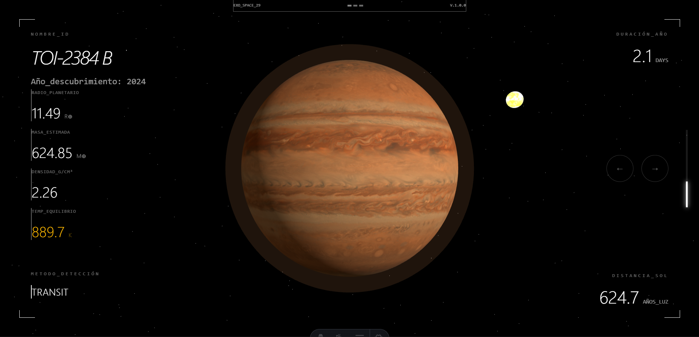

<p align="center">
  
</p>

<h3 align="center">
ExoSpace es una sitio web de visualización de exoplanetas que consume datos en tiempo real de la NASA Exoplanet Archive.
</h3>

---

<h2 align="center">Stack Tecnológico 🧑‍💻</h2>

<p align="center">
  <a href="https://skillicons.dev">
    
  </a>
</p>

<br/>

> [!WARNING]
> ⚠️ Lo exoplanetas visualizados en 3D aun no estan siendo representados a sus caracteristicas descubiertas.

<h2 align="center">Project Setup 🚀</h2>

### 📄 Requisitos previos

- pnpm

### 📁 Clonar Repositorio

To use this project locally, run the following commands in your terminal:

```bash
git clone https://github.com/EricV29/exospace.git
cd exospace
pnpm install
```

## 🧩 Available Scripts

### 🔧 Development

Ejecutar modo desarrollo:

```bash
pnpm dev
```

```
📁 project/
┣ 📂 public/
┃
┣ 📂 src/
┃ ┣ 📂 assets/
┃ ┣ 📂 components/
┃ ┣ 📂 layouts/
┃ ┣ 📂 pages/
┃ ┣ 📂 styles/
┃ ┣ 📂 types/
┃
┣ 📜 package.json
┣ ⚙️ tsconfig.ts
```
