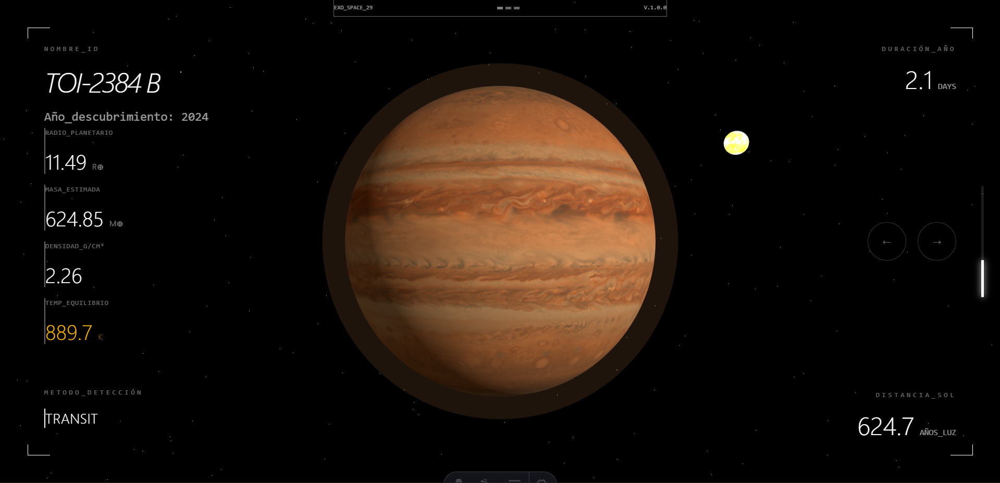

<div align="center">
    

# Jotadobleu - Catálogo Digital

ExoSpace es una sitio web de visualización de exoplanetas que consume datos en tiempo real de la NASA Exoplanet Archive.

  
</div>

#

<h2 align="center">Stack Tecnológico 🧑‍💻</h2>

<p align="center">
  <a href="https://skillicons.dev">
    
  </a>
  <br />
  
  
  
  
</p>

## 📋 Tabla de contenidos

- [Jotadobleu - Catálogo Digital](#jotadobleu---catálogo-digital)
- [](#)
  - [📋 Tabla de contenidos](#-tabla-de-contenidos)
  - [📖 Descripción](#-descripción)
  - [🎥 Demo](#-demo)
  - [🛠️ Tecnologías](#️-tecnologías)
  - [✅ Requisitos previos](#-requisitos-previos)
  - [🚀 Instalación](#-instalación)
  - [⚙️ Configuración](#️-configuración)
  - [💻 Uso](#-uso)
  - [📁 Estructura del proyecto](#-estructura-del-proyecto)
  - [📄 Licencia](#-licencia)

---

## 📖 Descripción

**ExoSpace** es una sitio web de visualización de exoplanetas que consume datos en tiempo real de la NASA Exoplanet Archive.
> [!WARNING]
> ⚠️ Lo exoplanetas visualizados en 3D aun no estan siendo representados a sus caracteristicas descubiertas.

---

## 🎥 Demo

> Aún no hay demo.

---

## 🛠️ Tecnologías

| Capa            | Tecnología                       |
| --------------- | -------------------------------- |
| Frontend        | Astro 6, TypeScript              |
| Estilos         | Tailwind CSS 3                   |
| Package manager | pnpm 11.1.1                      |

---

## ✅ Requisitos previos

- Node.js
- pnpm
  
---

## 🚀 Instalación

```bash
# 1. Clonar el repositorio
git clone https://github.com/EricV29/exospace.git
cd exospace

# 2. Instalar dependencias
pnpm install
```

---

## ⚙️ Configuración

Nada adicional

---

## 💻 Uso

```bash
# Desarrollo con HMR
pnpm dev

# Typecheck + build para producción
pnpm build

# Vista previa del build
pnpm preview
```

Accede a la app en `http://localhost:5173`.

---

## 📁 Estructura del proyecto

```
src/
├── assets/
├── components/         
├── layouts/         
├── pages/         
├── styles/         
├── types/         
│
├── tsconfig.ts
└── package.json
```

---

## 📄 Licencia

Distribuido bajo MIT. Consulta [`LICENSE`](LICENSE) para más información.
